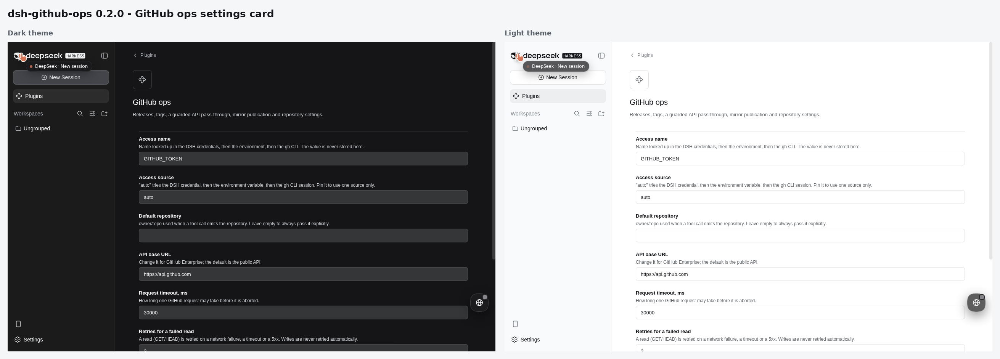

# 📦 @goodandready/dsh-github-ops

<div align="center">

<h3>Advanced GitHub Operations, Releases, CI Runs, Secrets & Sanitized Mirrors for DeepSeek Harness</h3>

<p align="center">
  <a href="https://www.npmjs.com/package/@goodandready/dsh-github-ops"></a>
  <a href="LICENSE"></a>
  <a href="https://github.com/topics/dsh-plugin"></a>
  <a href="https://nodejs.org"></a>
</p>

<p align="center">
  <a href="https://goodandready.app/"></a>
</p>

<p align="center">
  <a href="README.md"><b>🇬🇧 English</b></a> •
  <a href="README.zh.md"><b>🇨🇳 中文说明</b></a> •
  <a href="README.ru.md"><b>🇷🇺 Русский</b></a>
</p>

<table align="center">
  <tr>
    <td align="center">
      ⭐ <strong>If you like this plugin, please star it on GitHub</strong> — it shows me that the plugin is useful to you and motivates me to keep developing it.
      <br><br>
      🐛 <strong>If you find a bug or would like to request a feature</strong>, open a GitHub issue in any language — I will review your proposal and implement useful suggestions in a future plugin version.
    </td>
  </tr>
</table>

</div>

---

GitHub operations for [DeepSeek Harness](https://github.com/topics/dsh-plugin): releases,
tags, a guarded generic API pass-through, workflow runs, secrets and sanitized mirror
publication.

The plugin exists because the release pipeline needs operations the existing GitHub
plugin does not provide — releases and tags first, then a way to publish a GitHub mirror
that carries the **product** and not the whole development tree.

> **Status: work in progress, not released.** The public release happens only after the
> plugin carries the full tool set (see [Roadmap](#roadmap)).

## Install

```bash
dsh plugin --profile web add @goodandready/dsh-github-ops
```

Requires a GitHub token in the DSH credential service. Store the token under a name
(default `GITHUB_TOKEN`) and put only that **name** in the plugin settings.

## Settings

| Setting | Default | Meaning |
|---|---|---|
| `tokenEnv` | `GITHUB_TOKEN` | Name looked up in the DSH credentials, then the environment, then the `gh` CLI. The value is never stored in settings. |
| `tokenSource` | `auto` | Where access comes from: `auto` tries the DSH credential, then the environment variable, then the `gh` CLI session; pin it to `credentials`, `env` or `gh`. |
| `defaultRepository` | *(empty)* | `owner/repo` used by tools that omit `repository`. |
| `baseUrl` | `https://api.github.com` | API base; change it for GitHub Enterprise. |
| `timeoutMs` | `30000` | Per-request timeout. |
| `maxRetries` | `2` | Retries for a failed read (never for a write). |
| `reviewRulesJson` | *(empty)* | Review-rule overrides as JSON: `sensitivePaths`, `sensitiveSeverity`, `attentionPaths`, `migrationPaths`, `testsRequired`, `sourcePatterns`, `testPatterns`, `largeDiffLines`. |
| `reviewJobTimeoutMs` | `120000` | How long a background review job may run. |
| `cacheTtlMs` | `60000` | How long a read is served from the in-memory cache. Writes always go to the network and clear it. Set `0` to switch the cache off. |
| `interceptLinks` | `false` | Let a `github.com` link clicked in the conversation record which repository the Source Control tab and the panel should follow. The link always opens in the browser either way. |
| `guidance` | `true` | Add a short paragraph about this plugin to the system prompt. |
| `guidanceText` | *(empty)* | Replace that paragraph with your own text. |
| `oauthClientId` | the public `gh` CLI application | OAuth application used by `gh_auth_login`. |
| `oauthScope` | `repo workflow gist read:org` | Scope requested by `gh_auth_login`. |
| `oauthClientSecretRef` | *(empty)* | Optional credential name holding the OAuth client secret. |
| `accessFile` | `$DSH_HOME/github-ops-auth.json` | Where `gh_auth_login` stores the sign-in (written `0600`). |

## Tools

### Releases

| Tool | What it does |
|---|---|
| `gh_release_list` | List releases, newest first (read-only). |
| `gh_release_view` | Read one release by tag: flags, notes, assets (read-only). |
| `gh_release_create` | Create a release for a tag, optionally on a specific commit. |
| `gh_release_edit` | Edit title, notes, draft/prerelease, and **which release is latest**. |
| `gh_release_delete` | Delete a release (requires `confirm: true`). |
| `gh_release_asset_list` | List release assets with sizes and download counts (read-only). |
| `gh_release_asset_upload` | Upload a file asset (.tgz, binary) to a release (requires `confirm: true`). |
| `gh_release_asset_delete` | Delete a release asset by ID (requires `confirm: true`). |
| `gh_release_notes_generate` | Generate release notes for a tag from merged PRs and commits (read-only). |

`gh_release_edit` with `makeLatest: true` is the step that keeps the repository badge on
the current version: creating older releases afterwards otherwise moves “Latest” back.

### Tags

| Tool | What it does |
|---|---|
| `gh_tag_list` | List tags with their commit SHAs (read-only). |
| `gh_tag_create` | Create a tag — lightweight, or annotated when `message` is given. |
| `gh_tag_delete` | Delete a tag (requires `confirm: true`). |

### Generic API

`gh_api` reaches anything the typed tools do not cover (refs, rulesets, organizations,
gists). Reads are free. `POST`/`PATCH`/`PUT`/`DELETE` require `confirm: true`. Deleting a
repository, transferring a repository or deleting an organization is refused outright —
a single confirmation cannot make those safe.

### Issues and pull requests

| Tool | What it does |
|---|---|
| `gh_issue` | List or read issues (`action: list\|get\|comments`); pull requests come back as `kind: "pr"`. |
| `issue_open`, `issue_comment`, `issue_close` | Create an issue, comment on an issue or PR, close it (optionally with a state reason). |
| `gh_search` | Search issues and PRs with GitHub search syntax (separate quota). |
| `pr_create`, `pr_update` | Open a pull request from a head branch; edit title, body, state or base. |
| `pr_merge` | Merge a PR (merge/squash/rebase), optionally deleting the head branch. |
| `gh_review` | One review pack: metadata, areas, capped diff, comments, CI rollup and deterministic findings (secrets, migrations, CI config, source without tests, large diff). |
| `review_post` | Publish a review as one summary comment, or as line-anchored inline comments. |
| `gh_checks` | Check runs, legacy statuses and one rollup verdict for a commit. |
| `ci_run` | One-shot review of a PR with a rule-based verdict. |
| `pr_review_threads` | List review discussion threads with comments and resolution status (read-only). |
| `pr_thread_reply` | Reply to a review discussion thread by threadId or commentId (requires `confirm: true`). |
| `pr_thread_resolve` | Mark a review discussion thread resolved or unresolved (requires `confirm: true`). |

### Mirror publication

| Tool | What it does |
|---|---|
| `gh_mirror_check` | Read-only plan: which product files would reach the mirror, how many stay behind, and why a publication must be refused. |
| `gh_mirror_publish` | Publish the sanitized tree: one commit on top of the mirror branch, fast-forward, **never a force**. `dryRun: true` previews; writing needs `confirm: true`. |

The allowlist is the package manifest's own `files` plus `.gitignore`, `LICENSE`,
README trio, `CHANGELOG.md` and `cordis.patch.yml`. `docs/**` and agent instructions are
forbidden even when a manifest lists them; shipped tooling such as `scripts/**` is
published because it is part of the package.

### Workflow runs

| Tool | What it does |
|---|---|
| `gh_run_list`, `gh_run_view` | List runs (branch, workflow, status filters) and read one run. |
| `gh_run_jobs` | Jobs with their steps, and the steps that failed — usually enough to diagnose a failure. |
| `gh_run_rerun`, `gh_run_cancel` | Re-run all or only failed jobs; cancel an in-progress run (needs `confirm: true`). |
| `gh_run_logs` | Returns the logs archive URL: GitHub answers with a redirect to a zip, which is not pulled into the conversation. |
| `gh_run_dispatch` | Trigger a workflow_dispatch event with inputs (requires `confirm: true`). |
| `gh_run_log_summary` | Compact failed step log summary with stripped ANSI codes and masked secrets (read-only). |

### Repository settings

| Tool | What it does |
|---|---|
| `gh_variable_list/set/delete` | Actions variables, repository-wide or per environment. |
| `gh_secret_list/set/delete` | Actions secrets. Setting one uses sealed-box encryption through the optional `tweetnacl` package; without it the tool says what to install instead of writing a broken value. |
| `gh_ruleset_list/view/apply/delete` | Repository rulesets: read, create, update, delete. |
| `gh_branch_protection_get/set/delete` | Classic branch protection: required reviews, status checks, admin enforcement, force-push and deletion flags. |

### Reports

| Tool | What it does |
|---|---|
| `gh_repo_report` | Everything about a repository in one call: overview, latest release, open issues, recent commits, top contributors. A failing part degrades that part instead of failing the report. |
| `gh_weekly_digest` | What happened inside a window: releases, new issues, merged or closed pull requests, commits. Pull requests are reported separately, not as “new issues”. |
| `gh_notifications` | The attention queue for the account — mentions, review requests, assignments — grouped by reason. |
| `gh_repo_health` | A transparent maintenance score: five weighted dimensions, each with its evidence, plus the risks found and concrete next actions. A heuristic over public signals, not a security audit. |
| `gh_compare` | Two repositories side by side with numeric deltas for stars, forks and open issues. |
| `gh_contributors` | Top contributors of a repository by commit count. |
| `gh_user_repos` | A user's or organization's repositories sorted by stars. |
| `gh_trending` | Recently created repositories by stars, optionally filtered by language (uses the search quota). |
| `gh_commits` | Recent commits, optionally since a timestamp and on a specific branch. |
| `gh_help` | Every tool of this plugin, grouped by area, built from the registrations so it cannot go stale. |

### Files and branches

These publish content without a local checkout: the client builds a commit the way git does.

| Tool | What it does |
|---|---|
| `gh_repo_tree` | The file tree at a ref, recursively by default, with the truncation flag — far cheaper than walking directories. |
| `gh_push_files` | Commit files to a branch: blobs, a tree on top of the branch tree, a commit, then the ref moves. Creates the branch when it does not exist. `force` is never implied and needs `confirm: true`. |
| `gh_upload_project` | Create a repository, publish files into it and optionally open a pull request — one call. An existing repository is used as is instead of failing. |
| `gh_delete_file` | Delete one file (the blob sha is resolved first). Requires `confirm: true`. |
| `gh_delete_branch` | Delete a branch. Requires `confirm: true`. |

### Account and sign-in

| Tool | What it does |
|---|---|
| `gh_auth_login` | Start a GitHub device-flow sign-in: returns a short code and a URL for the human. |
| `gh_auth_finish` | Collect a started sign-in. The granted value is written to this plugin's own file with mode `0600` and is never returned in a result. |
| `gh_auth_status` | Where the access comes from (credential, environment, this plugin's sign-in, `gh` CLI), the account, the reported scopes and the remaining rate limit. |
| `gh_auth_logout` | Forget the sign-in stored by this plugin; other sources are untouched. Requires `confirm: true`. |

## Background reviews and commands

`gh_review_job` starts a review and returns a job id immediately; `gh_review_job_status`
reports it. With a host job registry the work is visible and cancellable in the UI; without
one it runs inside the plugin.

Slash commands are the fast path for a human:

| Command | What it does |
|---|---|
| `/pr create [title]` | Reads the current branch and origin, then instructs the model to call `pr_create`. |
| `/review [number]` | Reviews a pull request (or the one for the current branch). |
| `/issue new <title>` \| `/issue list` \| `/issue show <number>` | Opens, lists or reads issues. |
| `/gh [group\|tool]` | Points at the tools for releases, tags, mirror, runs, secrets, variables, rulesets or branch protection. |

A command never writes to GitHub itself: it hands the model an instruction, so the write
still passes through the approval gate.

## Reliability

- Reads are cached for `cacheTtlMs`, so a composed report or a repeated listing does not
  spend the rate limit twice. Writes always reach the network and clear the cache.
- A cancelled turn cancels the request in flight, and the failure says so instead of
  pretending to be a timeout.
- Reads retry on a network failure, a timeout or a server error. Writes never retry: a
  repeated write is a decision, not an accident.
- Every list is also cut locally, because the API sometimes ignores the requested page size.
- A failure says what to do next: a missing credential, a missing scope, an object that is
  invisible (a draft release is only reachable by id), a conflict to re-read, a payload to
  fix, a timeout to retry — and a broken `/etc/hosts` entry when the network is unreachable.

## User interface

The plugin contributes four small surfaces, all read-only except the two documented
confirmations:

- **Access status in the plugin card.** Source, account, scopes, remaining rate limit and
  cache state. It is loaded from a local-only host route, so the access value never enters
  the conversation. States: loading, not configured (with guidance), ok, error.
- **Source Control tab** in the session view ring: repository path and branch with
  ahead/behind, change groups (conflicts, staged, changes, untracked), a diff pane for the
  selected file, an in-progress merge/rebase banner, and branches, tags and stashes. Reading
  only for now: the commit bar and the branch/stash actions are the next step.
- **GitHub panel** in the sidebar — it registers in better-sidebar and in the built-in right
  sidebar. Repository switcher with public search, a Code tree with a file preview, and
  Issues, Pull requests, Actions and Inbox tabs.
- **Pull request bar** above the composer. It appears when the branch has commits the
  upstream does not, and its buttons put an instruction on the clipboard instead of writing:
  the call still goes through the normal approval contour.

A short paragraph about the plugin is added to the system prompt (`guidance`), and a
`github.com` link clicked in the conversation can record which repository to follow
(`interceptLinks`, off by default).

## Safety

- The token lives in the DSH credential service; settings hold only its name.
- Read operations never change state. A state-changing tool needs an explicit `confirm`
  flag, deleting a repository, transferring one or deleting an organization is refused
  outright, and whether a prompt is shown is the host approval contour — the plugin does
  not run an approval gate of its own.
- The client never logs the token, and every failure is reported as a value
  (`ok: false` with `status`, `code`, `rateLimit`) instead of an exception.
- Findings from `gh_review` are deterministic rules: they point at what needs attention
  and are never presented as a verdict on correctness.

## Roadmap

Everything planned for the first release is implemented. What remains is the release
process itself:

1. Preflight (`dsh-plugin-preflight`) and the package check.
2. Verification of the exact `.tgz` on the isolated DSH test server.
3. Acceptance of the same candidate on production.
4. Translation notes for `dsh-russian-lang`.
5. Public release (npm + GitHub) after an explicit go-ahead.

## Development

```bash
npm test        # node --test, no harness and no network: fetch is injected
```

Tests live next to the code they cover and never touch the network: the transport is a
parameter, so failure modes (404, rate limit, timeout, non-JSON body, short pages) are
exercised directly.

## Visual verification

The settings card, rendered by this release candidate on an isolated test server and captured
from the real interface in both themes:



What the picture shows: the plugin card with its title and description, the credential-name and
access-source fields with their hints, and the access block the card loads from the host route.
Both frames come from the same candidate and the same data.

## License

MIT — see [LICENSE](LICENSE).
